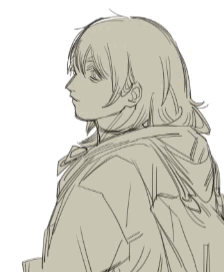

### Projeto individual da faculdade SPTech - 1° semestre ADS
---
 

    &nbsp;&nbsp;&nbsp;&nbsp; Meu nome é <b>Anne Yukari</b> e este é o meu primeiro projeto individual como aluna do 1° semestre na SPTech.   Desde pequena, eu sempre fui apaixonada pela criatividade — e isso se reflete tanto no meu amor por desenhar quanto na forma como vejo a tecnologia. Pois para mim, programar é como rabiscar minhas ideias no papel: começa com um traço solto, mas logo se transforma em algo com forma, cor e propósito. Sem um limite na imaginação.

### <b>Tema: O desenho como refúgio emocional</b>
Uma abordagem terapêutica para indivíduos com sintomas de depressão

<b>Descrição:</b>
Este projeto tem como objetivo investigar como o ato de desenhar pode funcionar como uma ferramenta terapêutica e emocional para pessoas que enfrentam a depressão. Busca compreender os efeitos do desenho no funcionamento da mente, especialmente em relação à regulação emocional, distração de pensamentos negativos e promoção do bem-estar. 

